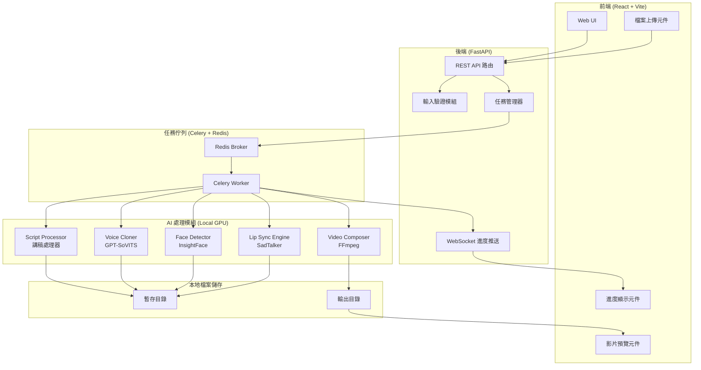
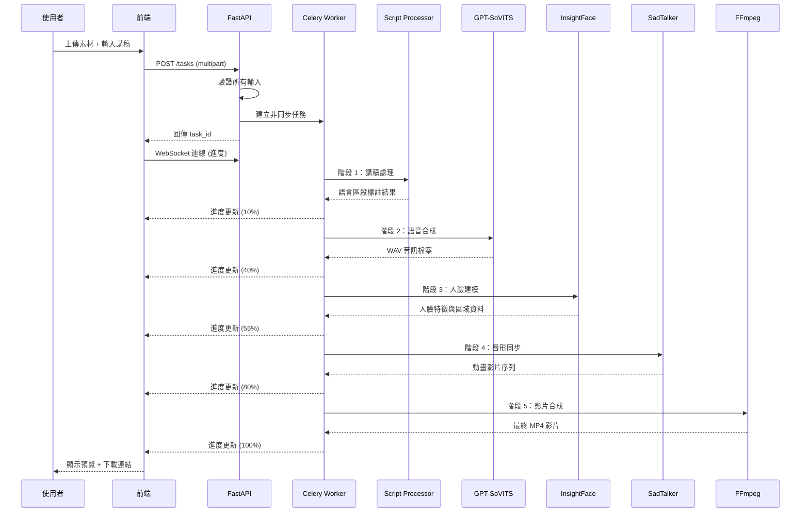
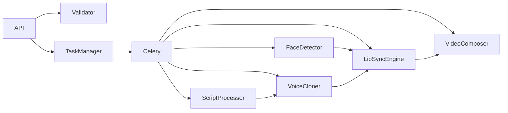

# Design Document

## Overview

本設計文件描述 AI 虛擬人物影片生成系統的技術架構。系統採用完全免費開源的技術棧，所有 AI 模型在本地 GPU 上推論，不依賴任何雲端付費服務，實現零成本部署。

核心技術選型：
- **語音合成/聲音複製**：GPT-SoVITS（少量樣本語音複製，支援中英文）
- **唇形同步**：SadTalker（CVPR 2023，單張圖片 + 音訊驅動說話人臉動畫）
- **人臉偵測與分析**：InsightFace（MIT License，2D/3D 人臉分析）
- **影片合成**：FFmpeg（免費開源多媒體處理框架）
- **後端框架**：FastAPI（Python 非同步 Web 框架）
- **前端框架**：React + Vite（免費開源前端工具鏈）
- **任務佇列**：Celery + Redis（免費開源分散式任務佇列）

系統接受使用者上傳的聲音樣本、人物外觀素材（圖片或影片）及講稿文字，經過語音合成、人臉建模、唇形同步和影片合成等處理階段，輸出具有目標聲音與外觀的自然人物講解影片。

## Architecture

### 系統架構圖



### 處理流程圖



### 設計決策與理由

| 決策 | 選擇 | 理由 |
|------|------|------|
| 語音複製模型 | GPT-SoVITS | 少量樣本（最低 3 秒）即可複製語音，支援中英文，推論速度快（RTF 0.028 on 4060Ti），完全開源 |
| 唇形同步模型 | SadTalker | CVPR 2023 論文，單張圖片即可生成說話影片，支援微表情和頭部動作，開源可商用 |
| 人臉偵測 | InsightFace | MIT License，高精度 2D/3D 人臉分析，提供人臉偵測、對齊、特徵提取完整工具鏈 |
| 影片合成 | FFmpeg | 業界標準多媒體處理工具，支援所有格式，零成本 |
| 後端框架 | FastAPI | 原生非同步支援、自動 API 文件、型別提示驗證、WebSocket 支援 |
| 任務佇列 | Celery + Redis | GPU 密集任務需背景執行，Redis 同時作為進度狀態儲存 |
| 前端框架 | React + Vite | 輕量快速、元件化開發、豐富生態系 |

## Components and Interfaces

### 1. API 路由模組 (`api/routes/`)

```python
# 任務相關 API
POST   /api/v1/tasks              # 建立生成任務（multipart form）
GET    /api/v1/tasks/{task_id}    # 查詢任務狀態
GET    /api/v1/tasks/{task_id}/download/video  # 下載影片
GET    /api/v1/tasks/{task_id}/download/audio  # 下載音訊
DELETE /api/v1/tasks/{task_id}    # 刪除任務及相關檔案

# WebSocket
WS     /api/v1/ws/tasks/{task_id}/progress  # 即時進度推送
```

### 2. 輸入驗證模組 (`core/validators/`)

```python
class VoiceSampleValidator:
    """聲音樣本驗證器"""
    ALLOWED_FORMATS = ["wav", "mp3", "flac"]
    MIN_DURATION_SEC = 3
    MAX_DURATION_SEC = 300
    MAX_FILE_SIZE_MB = 50
    MIN_SAMPLE_RATE_HZ = 16000

    def validate(self, file: UploadFile) -> ValidationResult: ...

class AppearanceAssetValidator:
    """外觀素材驗證器"""
    ALLOWED_IMAGE_FORMATS = ["jpg", "jpeg", "png", "webp"]
    ALLOWED_VIDEO_FORMATS = ["mp4", "mov"]
    MIN_RESOLUTION = (512, 512)
    MAX_IMAGE_SIZE_MB = 20
    MAX_VIDEO_SIZE_MB = 200
    MAX_VIDEO_DURATION_SEC = 60

    def validate(self, file: UploadFile) -> ValidationResult: ...

class ScriptValidator:
    """講稿驗證器"""
    MIN_LENGTH = 1
    MAX_LENGTH = 10000

    def validate(self, text: str) -> ValidationResult: ...
```

### 3. 講稿處理器 (`modules/script_processor.py`)

```python
class ScriptProcessor:
    """講稿文字處理模組"""

    def process(self, text: str) -> ScriptResult:
        """解析講稿，辨識語言區段和段落分隔"""
        ...

    def detect_language_segments(self, text: str) -> list[LanguageSegment]:
        """辨識連續字元區段的語言（中文/英文/未識別）"""
        ...

    def detect_paragraph_breaks(self, text: str) -> list[int]:
        """偵測段落分隔位置（連續換行符號）"""
        ...
```

### 4. 語音複製模組 (`modules/voice_cloner.py`)

```python
class VoiceCloner:
    """基於 GPT-SoVITS 的語音複製模組"""

    def __init__(self, model_path: str, device: str = "cuda"):
        """載入 GPT-SoVITS 模型"""
        ...

    def analyze_voice_sample(self, audio_path: str) -> VoiceProfile:
        """分析聲音樣本，提取音色特徵"""
        ...

    def synthesize(
        self,
        script_result: ScriptResult,
        voice_profile: VoiceProfile,
        output_path: str
    ) -> SynthesisResult:
        """根據講稿和聲音特徵合成語音"""
        ...
```

### 5. 人臉偵測模組 (`modules/face_detector.py`)

```python
class FaceDetector:
    """基於 InsightFace 的人臉偵測與分析模組"""

    def __init__(self, model_name: str = "buffalo_l"):
        """載入 InsightFace 模型"""
        ...

    def detect_faces(self, image: np.ndarray) -> list[FaceInfo]:
        """偵測圖片中的所有人臉"""
        ...

    def select_primary_face(self, faces: list[FaceInfo]) -> FaceInfo:
        """選取面積最大的人臉"""
        ...

    def extract_embedding(self, face: FaceInfo) -> np.ndarray:
        """提取人臉特徵向量（用於相似度比對）"""
        ...
```

### 6. 唇形同步引擎 (`modules/lip_sync_engine.py`)

```python
class LipSyncEngine:
    """基於 SadTalker 的唇形同步引擎"""

    def __init__(self, checkpoint_dir: str, device: str = "cuda"):
        """載入 SadTalker 模型權重"""
        ...

    def generate(
        self,
        source_image: str,
        audio_path: str,
        output_path: str,
        fps: int = 25,
        still_mode: bool = False,
        enhancer: str | None = None
    ) -> LipSyncResult:
        """生成唇形同步影片"""
        ...
```

### 7. 影片合成器 (`modules/video_composer.py`)

```python
class VideoComposer:
    """基於 FFmpeg 的影片合成模組"""

    def compose(
        self,
        video_path: str,
        audio_path: str,
        output_path: str,
        resolution: tuple[int, int] = (1280, 720),
        fps: int = 25,
        video_codec: str = "libx264",
        audio_codec: str = "aac"
    ) -> ComposeResult:
        """合併音訊與影像為最終影片"""
        ...

    def extract_audio_mp3(
        self,
        audio_path: str,
        output_path: str,
        bitrate: str = "128k"
    ) -> str:
        """將音訊轉換為 MP3 格式"""
        ...

    def get_av_sync_offset(self, video_path: str) -> float:
        """檢測音影時間偏移（毫秒）"""
        ...
```

### 8. 任務管理器 (`core/task_manager.py`)

```python
class TaskManager:
    """任務生命週期管理"""

    def create_task(self, task_input: TaskInput) -> Task:
        """建立新的生成任務"""
        ...

    def get_task_status(self, task_id: str) -> TaskStatus:
        """查詢任務狀態"""
        ...

    def update_progress(
        self, task_id: str, stage: str, percentage: int
    ) -> None:
        """更新任務進度"""
        ...

    def cleanup_expired_tasks(self, max_age_hours: int = 24) -> int:
        """清理過期任務檔案"""
        ...
```

### 介面間依賴關係



## Data Models

### 核心資料模型

```python
from pydantic import BaseModel
from enum import Enum
from datetime import datetime

class TaskStage(str, Enum):
    VOICE_ANALYSIS = "聲紋分析"
    VOICE_SYNTHESIS = "語音合成"
    FACE_MODELING = "人臉建模"
    LIP_SYNC = "唇形同步"
    VIDEO_COMPOSE = "影片合成"

class TaskState(str, Enum):
    PENDING = "pending"
    PROCESSING = "processing"
    COMPLETED = "completed"
    FAILED = "failed"

class LanguageType(str, Enum):
    CHINESE = "zh"
    ENGLISH = "en"
    UNKNOWN = "unknown"

class LanguageSegment(BaseModel):
    text: str
    language: LanguageType
    start_index: int
    end_index: int

class ScriptResult(BaseModel):
    segments: list[LanguageSegment]
    paragraph_breaks: list[int]  # 段落分隔在字元流中的位置
    total_chars: int

class VoiceProfile(BaseModel):
    sample_path: str
    duration_sec: float
    sample_rate: int
    embedding: list[float]  # 聲紋特徵向量

class FaceInfo(BaseModel):
    bbox: tuple[int, int, int, int]  # x1, y1, x2, y2
    area: int
    confidence: float
    embedding: list[float]  # 人臉特徵向量
    landmarks: list[tuple[float, float]]  # 臉部關鍵點

class SynthesisResult(BaseModel):
    audio_path: str
    duration_sec: float
    sample_rate: int
    bit_depth: int

class LipSyncResult(BaseModel):
    video_path: str
    fps: float
    duration_sec: float
    resolution: tuple[int, int]

class ComposeResult(BaseModel):
    video_path: str
    audio_mp3_path: str
    duration_sec: float
    resolution: tuple[int, int]
    fps: float
    av_sync_offset_ms: float

class ValidationResult(BaseModel):
    is_valid: bool
    errors: list[str]

class TaskProgress(BaseModel):
    task_id: str
    state: TaskState
    current_stage: TaskStage | None
    percentage: int  # 0-100
    error_message: str | None
    error_stage: TaskStage | None

class Task(BaseModel):
    task_id: str
    state: TaskState
    created_at: datetime
    updated_at: datetime
    progress: TaskProgress
    voice_sample_path: str
    appearance_asset_path: str
    script_text: str
    output_video_path: str | None
    output_audio_path: str | None
    download_expires_at: datetime | None  # 建立後 24 小時

class TaskInput(BaseModel):
    voice_sample: bytes
    voice_sample_filename: str
    appearance_asset: bytes
    appearance_asset_filename: str
    script_text: str
```

### 檔案儲存結構

**預設根目錄**：`C:\Users\ariel\OneDrive\Desktop\ai-avatar-output\`

可透過環境變數 `AVATAR_OUTPUT_DIR` 覆蓋預設路徑。

```
C:\Users\ariel\OneDrive\Desktop\ai-avatar-output\
├── tasks/
│   ├── {task_id}/
│   │   ├── input/
│   │   │   ├── voice_sample.wav
│   │   │   ├── appearance.jpg
│   │   │   └── script.txt
│   │   ├── intermediate/
│   │   │   ├── voice_profile.json
│   │   │   ├── synthesized_audio.wav
│   │   │   ├── face_data.json
│   │   │   └── lip_sync_video.mp4
│   │   └── output/
│   │       ├── final_video.mp4
│   │       └── final_audio.mp3
│   └── ...
└── models/
    ├── gpt-sovits/
    ├── sadtalker/
    └── insightface/
```

### Redis 儲存結構

```
task:{task_id}:status    -> JSON (TaskProgress)
task:{task_id}:meta      -> JSON (Task metadata)
tasks:active             -> SET of active task_ids
```


## Correctness Properties

*A property is a characteristic or behavior that should hold true across all valid executions of a system-essentially, a formal statement about what the system should do. Properties serve as the bridge between human-readable specifications and machine-verifiable correctness guarantees.*

### Property 1: Voice sample validation correctness

*For any* audio file metadata consisting of (format, sample_rate, duration, file_size), the VoiceSampleValidator SHALL accept the file if and only if: format in {wav, mp3, flac} AND sample_rate >= 16000 AND 3 <= duration <= 300 AND file_size <= 50MB. Otherwise it SHALL reject with an error message listing the specific violation(s).

**Validates: Requirements 1.1, 1.2, 1.3, 1.5**

### Property 2: Image asset validation correctness

*For any* image file metadata consisting of (format, width, height, file_size), the AppearanceAssetValidator SHALL accept the file if and only if: format in {jpg, jpeg, png, webp} AND width >= 512 AND height >= 512 AND file_size <= 20MB. Otherwise it SHALL reject with an error message listing the specific violation(s).

**Validates: Requirements 2.1, 2.5, 2.6, 2.7**

### Property 3: Video asset validation correctness

*For any* video file metadata consisting of (format, width, height, duration, file_size), the AppearanceAssetValidator SHALL accept the file if and only if: format in {mp4, mov} AND width >= 512 AND height >= 512 AND duration <= 60 AND file_size <= 200MB. Otherwise it SHALL reject with an error message listing the specific violation(s).

**Validates: Requirements 2.2, 2.6, 2.7, 2.8**

### Property 4: Primary face selection by maximum area

*For any* non-empty list of detected FaceInfo objects with distinct areas, the select_primary_face function SHALL return the FaceInfo with the largest area value.

**Validates: Requirements 2.3**

### Property 5: Script language segmentation round-trip and correctness

*For any* valid script text (1-10000 chars, at least one non-whitespace), the ScriptProcessor SHALL produce segments where: (1) concatenating all segment texts in order reproduces the original text exactly, (2) each segment labeled "zh" contains only CJK characters, each segment labeled "en" contains only Latin/ASCII characters, each segment labeled "unknown" contains characters outside those ranges, (3) consecutive double-newline positions are identified as paragraph breaks, and (4) the text is rejected if it is empty, all-whitespace, or exceeds 10000 characters.

**Validates: Requirements 3.1, 3.2, 3.3, 3.5**

### Property 6: Composition timeout decision correctness

*For any* pair of (video_duration_sec, elapsed_time_sec), the timeout decision function SHALL return true (timeout) if and only if elapsed_time_sec > video_duration_sec * 3 AND elapsed_time_sec > 180. Otherwise it SHALL return false (continue processing).

**Validates: Requirements 6.8**

### Property 7: Progress stage percentage monotonicity

*For any* sequence of task stage transitions following the order [voice_analysis, voice_synthesis, face_modeling, lip_sync, video_compose], the progress percentage reported at the start of each subsequent stage SHALL be strictly greater than the percentage at the start of the previous stage.

**Validates: Requirements 7.2**

### Property 8: Download link temporal validity

*For any* task completion timestamp T and any access timestamp A, the download link SHALL be valid if and only if A - T < 24 hours (86400 seconds). Otherwise the link SHALL be expired/invalid.

**Validates: Requirements 7.4**

### Property 9: Task submission validation completeness

*For any* combination of task inputs where K items (0 <= K <= 3) out of {voice_sample, appearance_asset, script} are missing or have file_size = 0, the submission validator SHALL: (1) reject the submission if K > 0, (2) list exactly K items in the error response (one for each invalid input), and (3) when K = 0 and all items pass individual validation, produce a summary containing the correct voice sample duration, appearance asset type name, and script character count.

**Validates: Requirements 8.1, 8.2, 8.5**

## Error Handling

### 錯誤處理策略

系統採用分層式錯誤處理架構，確保每個階段的錯誤都能被捕獲、報告並正確恢復。

### 1. 輸入驗證層錯誤

| 錯誤類型 | 處理方式 | 回應 |
|----------|---------|------|
| 不支援的檔案格式 | 立即拒絕，不儲存檔案 | 400 Bad Request + 支援格式清單 |
| 檔案大小超限 | 立即拒絕 | 400 Bad Request + 大小限制說明 |
| 音訊時長不符 | 解碼後拒絕，刪除暫存 | 400 Bad Request + 時長範圍說明 |
| 解析度不足 | 解碼後拒絕，刪除暫存 | 400 Bad Request + 最低解析度要求 |
| 無法偵測人臉 | InsightFace 回報後拒絕 | 400 Bad Request + 需正面清晰人臉 |
| 講稿為空或超長 | 立即拒絕 | 400 Bad Request + 字數範圍與目前字數 |
| 上傳逾時（120 秒） | 終止連線，釋放暫存 | 408 Request Timeout |
| 檔案損壞無法解碼 | 解碼失敗時拒絕 | 400 Bad Request + 檔案損壞說明 |

### 2. 處理管線錯誤

```python
class PipelineError(Exception):
    """管線處理錯誤基類"""
    def __init__(self, stage: TaskStage, reason: str, recoverable: bool = True):
        self.stage = stage
        self.reason = reason
        self.recoverable = recoverable

class VoiceSynthesisError(PipelineError):
    """語音合成失敗 - 不輸出不完整音訊"""
    pass

class LipSyncError(PipelineError):
    """唇形同步失敗 - 停止動畫生成"""
    pass

class VideoComposeError(PipelineError):
    """影片合成失敗 - 保留已生成素材"""
    pass

class CompositionTimeoutError(PipelineError):
    """合成逾時 - 超過 video_duration*3 且超過 180 秒"""
    pass
```

### 3. 錯誤恢復機制

- **重試策略**：處理失敗時，系統記錄失敗階段，使用者可從失敗階段重新開始（不需重新上傳素材）
- **中間產物保留**：影片合成失敗時，已生成的語音和影像素材保留在 `intermediate/` 目錄
- **不完整輸出防護**：語音合成失敗時不寫入任何音訊檔案，確保 `output/` 目錄無損壞檔案
- **暫存清理**：上傳失敗或驗證失敗時，已接收的暫存資料在回應後立即釋放
- **過期清理**：背景排程任務每小時檢查並清理超過 24 小時的任務檔案

### 4. WebSocket 錯誤通知格式

```python
class ErrorNotification(BaseModel):
    type: str = "error"
    task_id: str
    stage: TaskStage  # 失敗的階段名稱
    error_category: str  # 錯誤原因類別
    message: str  # 使用者可讀的錯誤訊息
    recoverable: bool  # 是否可重試
    retry_from_stage: TaskStage | None  # 重試起始階段
```

## Testing Strategy

### 測試架構總覽

本系統採用雙軌測試策略：**屬性基礎測試（Property-Based Testing）** 驗證核心邏輯的正確性，**整合測試** 驗證 AI 模型輸出品質和端對端流程。

### Property-Based Testing 配置

- **測試框架**：Hypothesis（Python PBT 框架）
- **最低迭代次數**：每個屬性測試至少 100 次迭代
- **標記格式**：`Feature: ai-avatar-video-generator, Property {N}: {property_text}`

### 測試層級

#### 1. Property-Based Tests（屬性測試）

驗證系統的核心邏輯正確性，無需 GPU 推論：

| Property | 測試目標 | 生成策略 |
|----------|---------|---------|
| Property 1 | VoiceSampleValidator | 生成隨機 (format, sample_rate, duration, file_size) 組合 |
| Property 2 | AppearanceAssetValidator (圖片) | 生成隨機 (format, width, height, file_size) 組合 |
| Property 3 | AppearanceAssetValidator (影片) | 生成隨機 (format, width, height, duration, file_size) 組合 |
| Property 4 | select_primary_face | 生成隨機 FaceInfo 列表（不同面積值） |
| Property 5 | ScriptProcessor | 生成隨機混合語言文字（中/英/特殊字元/換行） |
| Property 6 | timeout_decision | 生成隨機 (video_duration, elapsed_time) 數值對 |
| Property 7 | TaskManager.update_progress | 生成隨機階段轉換序列 |
| Property 8 | download_link_validity | 生成隨機 (completion_time, access_time) 時間戳對 |
| Property 9 | SubmissionValidator | 生成隨機輸入組合（部分缺失/部分為空） |

#### 2. Unit Tests（單元測試）

針對特定邊界條件和錯誤處理：

- 聲音樣本恰好 3 秒和 300 秒的邊界行為
- 圖片恰好 512x512 的邊界行為
- 講稿恰好 1 字和 10000 字的邊界行為
- 純空白字串的講稿拒絕
- 合成失敗時不寫入不完整檔案
- 上傳逾時時暫存清理

#### 3. Integration Tests（整合測試）

需要實際 AI 模型推論的測試（需 GPU 環境）：

- GPT-SoVITS 語音合成輸出格式驗證（WAV, 44100Hz, 16-bit）
- GPT-SoVITS 語音相似度 >= 0.75（speaker verification）
- SadTalker 輸出幀率 >= 24 fps
- SadTalker 唇形同步偏差 <= 80ms
- InsightFace 人臉偵測準確性
- FFmpeg 影片合成 A/V 同步 <= +/-40ms
- 完整管線端對端測試
- WebSocket 進度更新間隔 <= 3 秒
- 段落停頓靜音時長 0.5-1.5 秒

#### 4. Smoke Tests（冒煙測試）

快速確認系統基本運作：

- FastAPI 服務啟動正常
- Redis 連線正常
- Celery Worker 可接收任務
- AI 模型檔案存在且可載入
- FFmpeg 可執行
- 儲存目錄可寫入

### 測試環境需求

- **屬性測試 + 單元測試**：無 GPU 需求，可在 CI/CD 中執行
- **整合測試**：需 NVIDIA GPU（建議 8GB+ VRAM），本地開發環境執行
- **冒煙測試**：需完整部署環境（含 Redis、模型檔案）
